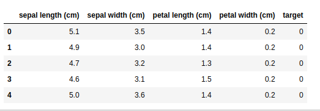

## Intoduction to Naive Bayes for Classification


This blog post is about understanding Naive Bayes algorithm for classification tasks.

The tutorial is divided into the following parts.

1. Introduction
2. Conditional Probability
3. Bayes Theorem
4. Naive Bayes Sample Code
5. Laplace Correction
6. Advantages and Disadvantages
7. Applications of Naive Bayes Algorithm
8. Tips to improve the power of Naive Bayes Model
9. References


### 1. Introduction

Naive Bayes classiffier is a probablistic machine learning model that’s used for classification tasks. Assume that we have a situation that we have made features out of a given dataset and the dataset is very large dataset we need a to create some basic machine learning model for this dataset and use it as baseline model to compare benchmarks with other classification models, in this case the best option is to use Naive Bayes classifier. Its extremely fast compared to any other model available and has an training time complexity of *O(Nd)* where N is the number of training examples and d is the dimensionality of the dataset or number of input features. 

So why the algorithm is called **Naive**?

Naive Bayes algorithm makes an assumption that the input features of the datset that is used for model are independent of each other.

### 2. Conditional Probability

Conditional probability is defined as the likelihood of an event or outcome occurring, based on the occurrence of a previous event or outcome. For example the conditional probability of an event B is the probability that the event will occur given the knowledge that an event A has already occurred and it is denoted by P(B/A) probablity of B given A. 


**Example**

Lets take a look at the below table.

|           | Male | Female | Total |
|-----------|------|--------|-------|
| Teachers  | 10   | 15     | 25    |
| Students  | 110  | 90     | 200   |
| Total     | 120  | 105    | 225   |

In the above table we have 10 male teachers and 15 female teachers and 100 male students and 90 female students. Suppose we need find probality of member being a teacher given that the member is male.


### 3. Bayes Theorem

The Bayes theorem describes the probability of an event based on the prior knowledge of the conditions that might be related to the event. In simple way suppose P(A) is the probablity of event A happens and P(B) is the probablity of event B happens suppose if we know the conditional probability P(B|A), then we can use the bayes rule to find out the P(A|B) .

Conditional probablity of B given A is


General equation for n input features.


Using the naive conditional independence assumption that


Since P(x_1,... x_n) is constant given the input, we can use the following classification rule:


**Example**

Jhon says he is itchy. There is a test for Allergy to humans, but this test is not always right

For people that really do have the allergy, the test says "Yes" 80% of the time.

For people that do not have the allergy, the test says "Yes" 10% of the time ("false positive").

If 1% of the population have the allergy, and Jhon's test says "Yes", what are the chances that Jhon really has the allergy?

<b>Given</b>

P(Allergy) is Probability of Allergy = 1%

P(Yes|Allergy) is probability of test saying "Yes" for people with allergy = 0.8 (80%)

1% have the allergy, and the test says "Yes" to 80% of them

99% do not have the allergy and the test says "Yes" to 10% of them

Therefore we can find P(Yes) as P(Yes) = 1% × 80% + 99% × 10% = 10.7%

<b>What do we need to find?</b>

We need to find probablity of Jhon will have allergy given that the test is "Yes".


### 4. Naive Bayes Sample Code

We will work Iris datset available in scikit-learn library. But sklearn provides a lot of different varitions of Naive Bayes Algorithm like

1. [GaussianNB](https://scikit-learn.org/stable/modules/generated/sklearn.naive_bayes.GaussianNB.html)
1. [MultinomialNB](https://scikit-learn.org/stable/modules/generated/sklearn.naive_bayes.MultinomialNB.html#sklearn.naive_bayes.MultinomialNB)
1. [ComplementNB](https://scikit-learn.org/stable/modules/generated/sklearn.naive_bayes.ComplementNB.html#sklearn.naive_bayes.ComplementNB)
1. [BernoulliNB](https://scikit-learn.org/stable/modules/generated/sklearn.naive_bayes.BernoulliNB.html#sklearn.naive_bayes.BernoulliNB)


<b>Which one to use??</b>

It completely on input features of the dataset we deal. In our case the dataset is iris dataset.

We can use Gaussian Naive Bayes because it assumes that features follow a normal distribution. Multinomial is used incase of if the features have discreate counts. Binomial Naive Bayes is useful if features contain binary values.

```python
from sklearn import datasets
import pandas as pd
import seaborn as sns
import matplotlib.pyplot as plt
from sklearn.naive_bayes import GaussianNB

# get the dataset
iris = datasets.load_iris()
# load the data into data frame
df = pd.DataFrame(data=iris['data'], columns=iris['feature_names'])
df['target'] = iris['target']
df.head()
```



```python
# define classifier
gnb = GaussianNB()
y_pred = gnb.fit(iris.data, iris.target).predict(iris.data)
print("Number of mislabeled points out of a total %d points : %d"
      % (iris.data.shape[0],(iris.target != y_pred).sum()))
```
Number of mislabeled points out of a total 150 points : 6


For Iris dataset only 6 datapoints are misclassified.

### 5. Laplace Correction

The conditional probality works fine for all the data which have some frequency but imagine a case we have some new categorical value for a feature in this case we have conditional property is zero this is known as **Zero conditional probability Problem**. The simplest way to overcome this is to use Laplace correction instead of giving zero probablity we add some value where we have zero frequency.

### 6. Advantages and Disadvantages
**Advantages**
1. Very fast it has train time complexity of O(Nd)
2. If the independence assumption holds then it works more efficiently than other algorithms.
3. It requires less training data.
4. It is highly scalable.
5. It can make probabilistic predictions.
6. Can handle both continuous and discrete data.

**Disadvantages**
1. The strong assumption about the features to be independent which is hardly true in real life applications.
2. Zero Frequency i.e. if the category of any categorical variable is not seen in training data set then model assigns a zero probability to that category and then a prediction cannot be made.
3. Naive Bayes is also known as a bad estimator, so the probability outputs from predict_proba are not to be taken too seriously.
4. It has high bais and low variance. Hence it makes its application limited.

### 7. Applications of Naive Bayes Algorithm
1. Text classification/ Spam Filtering/ Sentiment Analysis
2. Recommendation System: Naive Bayes Classifier and Collaborative Filtering together builds a Recommendation System that uses machine learning and data mining techniques to filter unseen information and predict whether a user would like a given resource or not.

### 8. Tips to improve the power of Naive Bayes Model
1. For Gaussian Naive Bayes the input features should have a Gaussian distribution if the features don't have normal distribution then we need to add make tranformations to make it follow normal distribution.
2. Handling zero conditional probabilty by using Laplace smoothing.
